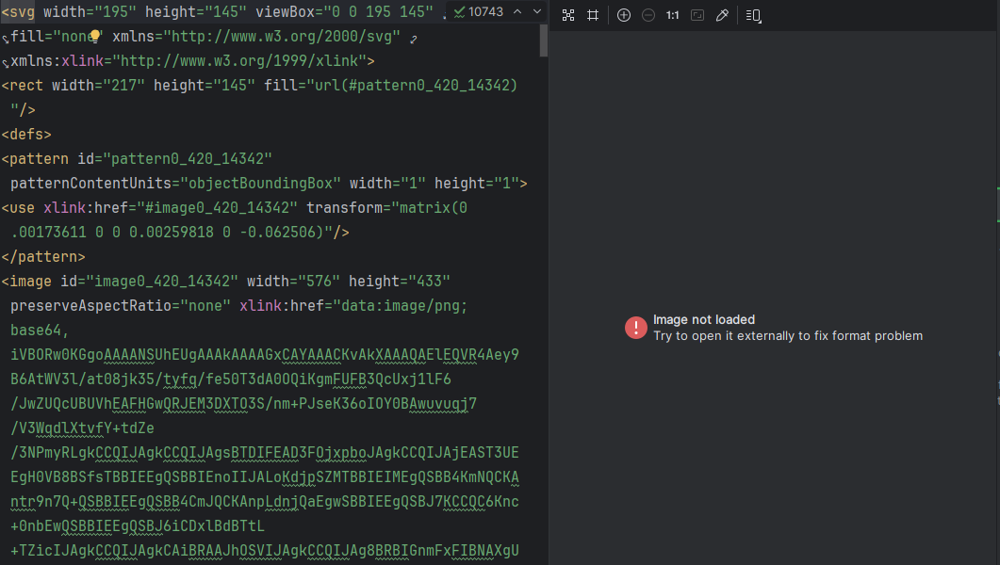

# Smart SVG Image

[](https://pub.dev/packages/smart_svg_image)
[](https://opensource.org/licenses/MIT)

A Flutter widget that intelligently renders SVG images with enhanced compatibility. It automatically handles common SVG rendering issues and provides a seamless image display experience.

## Common SVG Rendering Errors

The image below demonstrates the types of SVG rendering issues this package solves:

<p align="center">
  
</p>

## Features

- 🎯 **Smart Rendering**: Automatically detects the best way to render your SVG images
- 🖼️ **Optimized Display**: Renders images with better performance and compatibility
- 🔄 **Automatic Fallback**: Gracefully handles different SVG formats with built-in fallbacks
- 📐 **Customizable Sizing**: Supports custom height and width parameters
- ⚡ **Loading States**: Built-in loading indicator and error handling
- 🛠️ **Render Issue Fixer**: Automatically resolves common SVG rendering problems that cause images to appear clipped or invisible

## Getting started

Add this package to your `pubspec.yaml`:

```yaml
dependencies:
  flutter:
    sdk: flutter
  smart_svg_image: ^0.0.1
```

Then run:

```bash
flutter pub get
```

## Usage

### Basic Usage

```dart
import 'package:smart_svg_image/smart_svg_image.dart';

SmartSvgImage(
  svgAssetPath: 'assets/images/logo.svg',
  height: 200,
  width: 200,
)
```

### With Custom Dimensions

```dart
SmartSvgImage(
  svgAssetPath: 'assets/images/icon.svg',
  height: 100,
  width: 100,
)
```

### In a ListView or Grid

```dart
ListView.builder(
  itemCount: items.length,
  itemBuilder: (context, index) {
    return SmartSvgImage(
      svgAssetPath: items[index].svgPath,
      height: 64,
      width: 64,
    );
  },
)
```

## Common SVG Issues Solved

This package automatically handles the following SVG rendering problems:

| Issue | Description |
|-------|-------------|
| **Clipped/Invisible Images** | Fixes transform matrix issues that cause images to render outside the visible area |
| **Missing Images** | Handles SVGs with embedded image data that standard SVG renderers may not display |
| **Loading Failures** | Provides graceful fallback when SVG cannot be rendered normally |

## Additional information

### Prerequisites

- Flutter SDK >= 1.17.0
- Dart SDK >= 3.8.1

### Dependencies

- [flutter_svg](https://pub.dev/packages/flutter_svg) - For SVG rendering

### Contributing

Contributions are welcome! Please feel free to submit a Pull Request.

1. Fork the repository
2. Create your feature branch (`git checkout -b feature/AmazingFeature`)
3. Commit your changes (`git commit -m 'Add some AmazingFeature'`)
4. Push to the branch (`git push origin feature/AmazingFeature`)
5. Open a Pull Request

### License

This project is licensed under the MIT License - see the [LICENSE](LICENSE) file for details.

### Support

If you find this package helpful, please consider giving it a ⭐ on [GitHub](https://github.com/yourusername/smart_svg_image) and liking it on [pub.dev](https://pub.dev/packages/smart_svg_image)!
